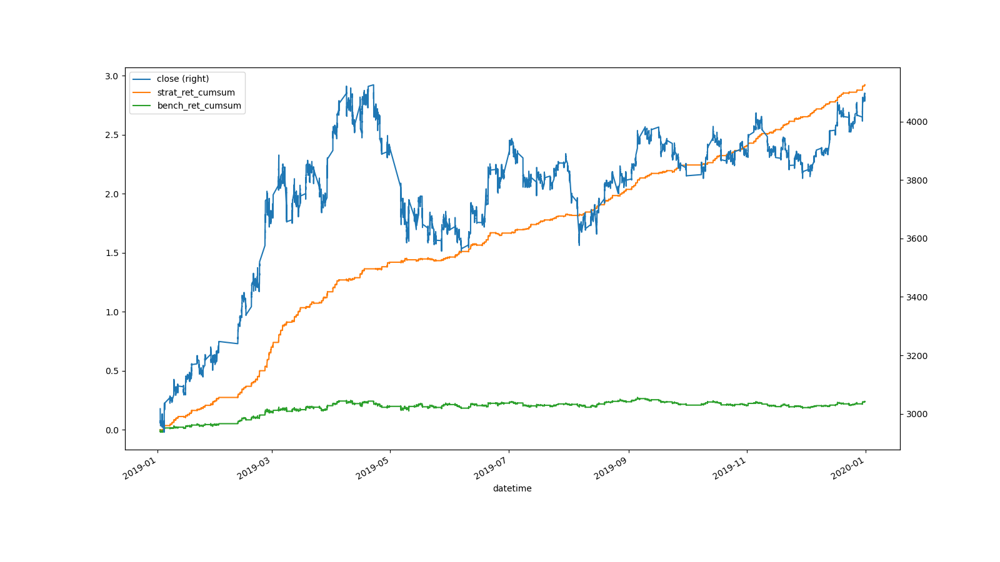
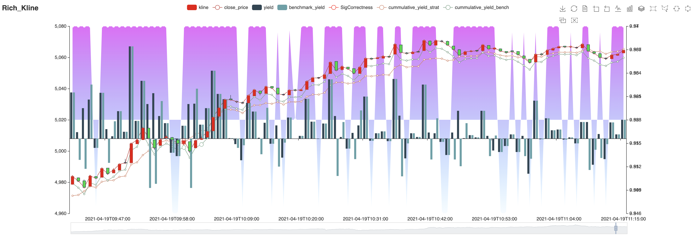
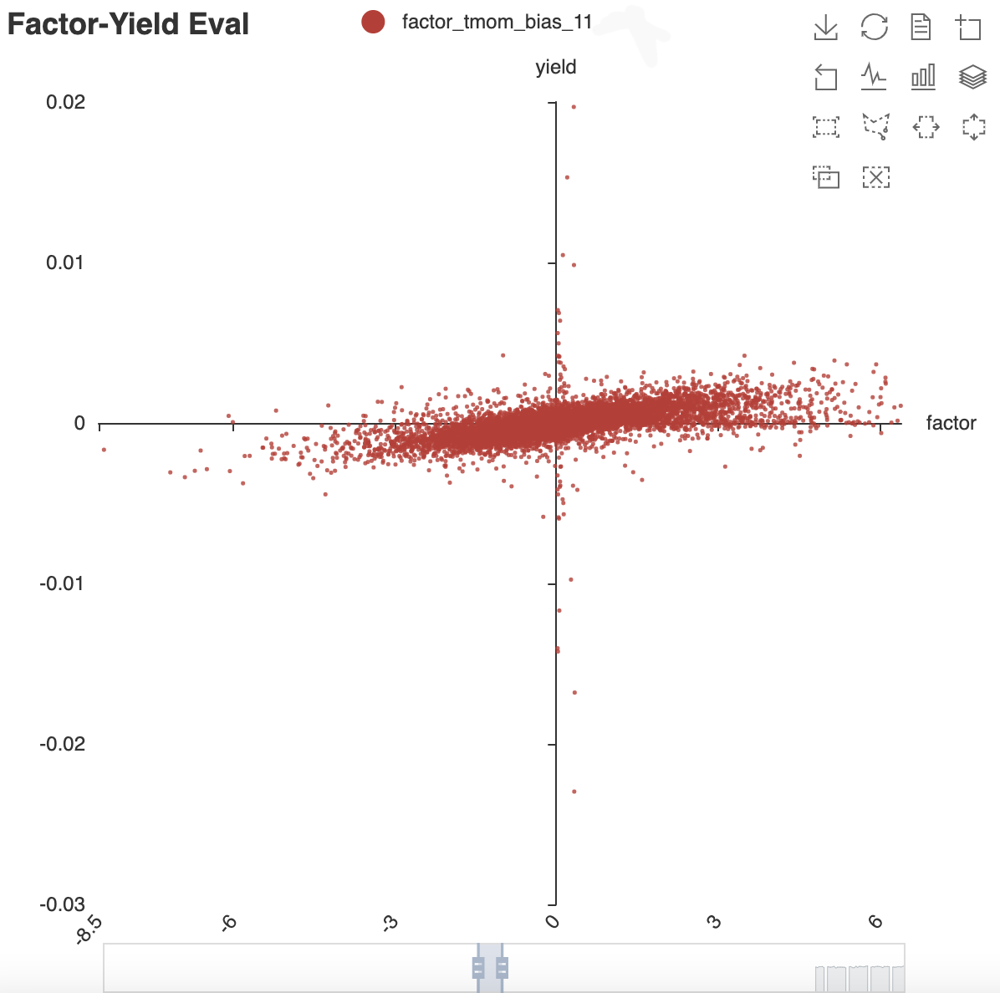
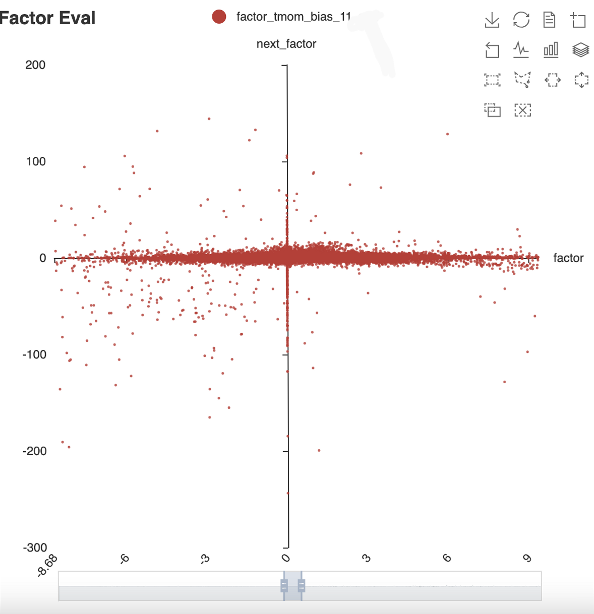

One time series analysis tool
===============

Organization
--------------------
      .
      ├── LICENSE
      ├── README.md
      ├── conf.ini
      ├── data
      │   └── futures
      │       └── raw
      ├── docs
      │   └── backtest
      ├── factor
      │   └── IF
      │       └── factor_tmom_T1_RTN_60.parquet
      ├── notebook
      │   └── Readme.md
      ├── requirements.txt
      ├── signal
      │   └── IF
      │       └── factor_tmom_T1_RTN_60.parquet
      └── src
          ├── __init__.py
          ├── __pycache__
          │   └── __init__.cpython-38.pyc
          ├── backtest
          │   ├── __init__.py
          │   ├── __pycache__
          │   ├── backtest_entry.py
          │   ├── func_modules
          │   └── test_config.py
          ├── data
          │   ├── __init__.py
          │   ├── __pycache__
          │   ├── clickhouse_control.py
          │   ├── db_conf.py
          │   └── redis_handle.py
          ├── factor
          │   ├── __init__.py
          │   ├── __pycache__
          │   └── factor.py
          └── visualization
              ├── __init__.py
              ├── __pycache__
              └── plotting.py

--------

##Install

    python3 -m pip install -r requirements.txt

##Guide 

使用本回测框架很简单：

~~1. 在factor.py中编写需要测试的因子（注意返回格式统一）~~

~~2. 在main.py中配置测试用的数据参数，and run that shit.~~
1. 在notebook中完成你的研究，然后将因子函数固化到factor.py，将因子和信号文件固化到factor，signal文件夹
2. 打开backtest文件夹，在test_config.py中配置你的回测, 并从backtest_entry.py运行回测
3. 回测结果内容可以在docs/backtest下看到。

回测结果会分为两部分呈现：
1. 在运行窗口会以logger的形式呈现部分回测信息，
2. 在docs/backtest文件夹下会生成每一次测试的记录文件，包括：
   
   ~~2.1 累计收益率走势图， 处理过后的行情数据，回测的详细信息记录；~~
   
   ~~2.2 如果回测结果满足一定的条件，则生成一个基于pyecharts的可视化页面。~~
   1. 所有回测的收益率叠加图，以及统计信息文件
   2. 每次回测的单独统计，包括回测记录文件，统计描述文件，收益、回撤、因子-收益、信号-收益图。

~~* 我本地用的是Clickhouse，为了简单方便，数据库部分可以按需求自行搭建，factor.py和backtest.py中的数据来源改成了data中的文件~~

----

## Result Description

每一次回测之后都会生成一份关于回测结果的描述性文档，如下所示：

   |                       | 36f0cb7d416cae661fbc45925b2c8049   | 9bc4fadb7954238a0f273161422f92a4   | 10bd7eae7e267ff5ec1d8add391a71d1   | ee0c9873702d2303baaf9ff922c626bd   |
   |:----------------------|:-----------------------------------|:-----------------------------------|:-----------------------------------|:-----------------------------------|
   | SignalShift           | 1                                  | 1                                  | 1                                  | 1                                  |
   | Timeframe             | T1                                 | T1                                 | T1                                 | D1                                 |
   | FrictionLoss          | 0.4                                | 0.4                                | 0.4                                | 0.4                                |
   | ReturnBase            | pre_close                          | pre_close                          | pre_close                          | pre_close                          |
   | Position              | 100 %                              | 100 %                              | 100 %                              | 100 %                              |
   | StopLoss              |                                    |                                    |                                    |                                    |
   | Sig0Action            | close                              | close                              | close                              | close                              |
   | DayClose              | 15:00                              | 15:00                              | 15:00                              |                                    |
   | TotalOpen             | 773                                | 738                                | 719                                | 197                                |
   | TotalClose            | 773                                | 738                                | 719                                | 197                                |
   | TotalBars             | 136406                             | 136406                             | 136406                             | 566                                |
   | TurnoverRate          | 1.13%                              | 1.08%                              | 1.05%                              | 69.61%                             |
   | TotalWin              | 62149                              | 62042                              | 62107                              | 294                                |
   | TotalLose             | 62497                              | 62436                              | 62166                              | 257                                |
   | W/L Ratio             | 0.99                               | 0.99                               | 1.0                                | 1.14                               |
   | RightTotal            | 62513                              | 62424                              | 62501                              | 296                                |
   | RightAvgReturn        | 0.00054                            | 0.00054                            | 0.00054                            | 0.01157                            |
   | RightMedianReturn     | 0.0004                             | 0.0004                             | 0.0004                             | 0.00791                            |
   | WrongTotal            | 61185                              | 61161                              | 60913                              | 243                                |
   | WrongAvgReturn        | -0.00054                           | -0.00054                           | -0.00054                           | -0.00804                           |
   | WrongMedianReturn     | -0.0004                            | -0.0004                            | -0.0004                            | -0.00614                           |
   | MissedTotal           | 7639                               | 7772                               | 7955                               | 26                                 |
   | StrategyReturn        | 58.97%                             | 63.65%                             | 62.68%                             | 145.78%                            |
   | StrategyAnnualReturn  | 27.94%                             | 30.6%                              | 29.99%                             | 86.61%                             |
   | BenchmarkReturn       | 23.5%                              | 23.5%                              | 23.5%                              | 60.49%                             |
   | BenchmarkAnnualReturn | 9.04%                              | 9.04%                              | 9.04%                              | 27.44%                             |
   | TotalFrictionLoss     | 20.53%                             | 19.6%                              | 19.09%                             | 5.32%                              |
   | SignalRatio           | 94.14%                             | 94.03%                             | 93.89%                             | 95.23%                             |
   | SharpeRatio           | 1.46                               | 1.57                               | 1.52                               | 2.91                               |
   | TailRatio             | 1.36                               | 1.24                               | 1.2                                | 1.67                               |
   | Alpha                 | 27.92%                             | 30.17%                             | 29.62%                             | 90.16%                             |
   | Beta                  | 15.52%                             | 18.74%                             | 18.63%                             | 2.07%                              |
   | MaxDrawdown           | -16.15%                            | -14.29%                            | -15.28%                            | -9.41%                             |
   | MaxDailyDrawdown      | -4.01%                             | -3.77%                             | -3.83%                             | -4.17%                             |

----

## Visualization

目前的可视化仅包含以下几个类别，所以后续在可视化方面还可以继续填充新功能、新需求。

1. 简单的收益曲线图

2. K线 + 收益曲线 + 信号正确性 复合图

   

3. 因子-收益相关性散点图

   

4. 因子自相关性散点图

   
** 以上是旧版本的图，如果需要可以在visualization/rich_visual.py内自行取用。

----

## 关于速度
目前仅backtest模块速度大致在 1000k bars/ s，~~但pyecharts绘图耗时比较严重，所以目前仅对较好的回测结果进行pyecharts的可视化。~~
耗时来自于两方面：
1. 散点图
2. 为了顾及matplotlib，不得不收集所有协程任务后再统一运行。而理想状态下应该是直接在新线程下动态添加协程任务。
----

## Todos

后续想要做的一些事情（以及一些尚存的问题）：

~~1. 完善这一套回测框架的逻辑验证工作，确保逻辑层面和最终结果的准确性。~~
1. matplotlib is not thread safe. 所以目前统计描述部分的异步过程并不能提高太多效率。
2. 充填、扩展回测结果统计分析的内容，以及扩展可视化内容。
3. 将目前的单品种、多因子改造为多品种、多因子框架。

~~4. python有些地方会遇到精度问题，目前这部分我还没有很好的解决方案，Decimal太慢。目前用pandas和numpy强制检查及转换类型可以部分规避这类风险。~~

#### Updates

* 210519 

更新了ClickHouse读数据支持， 以及部分初始化检查、建表操作。
  
更新了回测框架使用数据来源部分，方便直接feed dataframe或匹配数据库操作。
  
更新了requirements.txt文件。

* 210601

1. 回测框架结构改变： 

   1. 目前采用研究与回测分离的模式。研究统一在notebook文件夹下进行，
   2. 因子固化后存入factor/factor.py中，并将生成的因子与信号文件分别存入factor和signal文件夹下
   3. 回测过程直接读取行情数据文件和因子信号文件，不再实时生成因子及信号。
   4. 回测框架分为回测和统计描述两部分， 通过一个Redis建立的简易消息队列进行通信：
      1. 回测：大致功能与结构保持不变，每次回测需要配置test_config.py
      2. 统计描述：由于echarts实在太慢了，所以退而求其次，取消echarts画图，由matplotlib和seaborn替代部分功能。
2. 回测收益统计基准改变，之前是根据(close - pre_close) / pre_close 计算收益，目前在回测过程中改为点差，可以部分规避精度问题，
   但会造成回测结果描述的不一致，使用时需要注意这一点。

----

#### 联系作者：
   微信：muzexlxl

   email: muzexlxl@foxmail.com